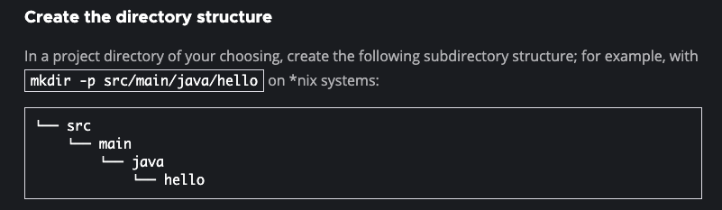

## Dependency Notes

[Framework Tutorial](https://www.youtube.com/watch?v=If1Lw4pLLEo&t=1682s)



[Beans Defintions and Placement](https://stackoverflow.com/questions/12893760/spring-cannot-find-bean-xml-configuration-file-when-it-does-exist) Beans must have a specified defintiion and a specific location for them spring.xml files to be placed.

```xml
<beans xmlns = "http://www.springframework.org/schema/beans"
    xmlns:xsi = "http://www.w3.org/2001/XMLSchema-instance"
    xsi:schemaLocation = "http://www.springframework.org/schema/beans
    http://www.springframework.org/schema/beans/spring-beans-3.0.xsd">
    <!-- define bean with id tag and class scope -->
    <bean id="vehicle" class="com.gregory.springapp.Car"></bean>
</beans>
```